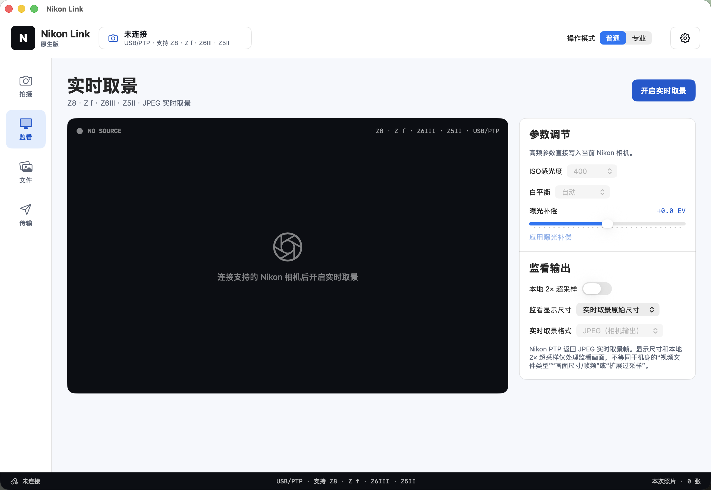
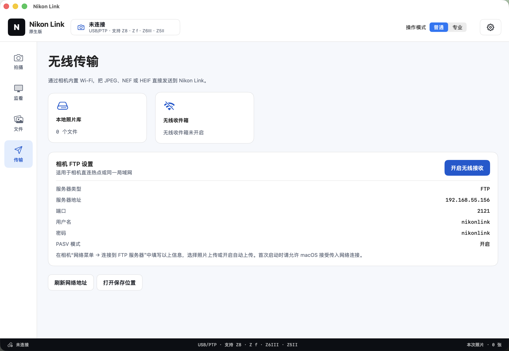

<div align="center">
  
  <h1>帧澈 ZENCHE</h1>
  <p><strong>跨平台相机控制与影像传输工具</strong></p>
  <p><em>Capture · Connect · Flow</em></p>
  <p><strong>连接相机，也连接完整工作流</strong></p>

  <p>
    <a href="https://github.com/Tauber01/ZENCHE/actions/workflows/build.yml"></a>
    <a href="https://github.com/Tauber01/ZENCHE/releases"></a>
    <a href="LICENSE"></a>
    <a href="https://github.com/Tauber01/ZENCHE/issues"></a>
  </p>
</div>

<p align="center">
  <a href="#简体中文">简体中文</a> ·
  <a href="#english">English</a> ·
  <a href="#日本語">日本語</a>
</p>

<a id="简体中文"></a>

## 简体中文

帧澈 ZENCHE 是一套本地优先的原生相机工作流工具：通过 USB/PTP 或 Wi‑Fi
PTP/IP 连接相机，支持 BLE 遥控快门与拍摄位置 XMP GPS 标记，并可通过 FTP、
HTTP 或 WebDAV 接收影像，再在同一个应用里完成预览、管理、导入与分享。

- 最新正式版：**v1.5.3**（[发布说明与下载](https://github.com/Tauber01/ZENCHE/releases/tag/v1.5.3)）
- 当前源码版本：**1.5.10 / build 37**
- 原生目标：**macOS · Windows · Android · HarmonyOS · iOS / iPadOS**
- 界面语言：**简体中文 · English · 日本語**（可在齿轮设置中即时切换）
- 相机档案：**46 款 Nikon / Sony / Canon 相机**（20 Nikon、12 Sony、14 Canon）
- 项目仓库：[github.com/Tauber01/ZENCHE](https://github.com/Tauber01/ZENCHE)
- 安装包：[v1.5.3 最新稳定版](https://github.com/Tauber01/ZENCHE/releases/tag/v1.5.3) · [全部版本](https://github.com/Tauber01/ZENCHE/releases)
- 官网兑换：[http://zenche.top/](http://zenche.top/)
- 爱发电购买兑换码：[https://www.ifdian.net/a/Tauber](https://www.ifdian.net/a/Tauber)
- 官方 QQ 群：**165315727**

> [!IMPORTANT]
> GitHub 公开稳定版与官网自动更新版分别按各自发布说明和 SHA-256 清单核验。项目仍在扩大实机验证范围；
> 重要拍摄请始终保留机内存储卡，不要把任何联机应用当作唯一备份。

### v1.5.10 官网更新

- iOS / iPadOS 新增可信局域网相机桥接：Sony 官方 Camera Remote SDK 在 macOS 桥接端运行；Nikon 使用明确标注的 PTP 兼容桥接。
- 五端拍照页新增“实时监看”开关。关闭只停止取景帧，不断开相机，也不影响快门；关闭后会立即清除缓存画面并显示明确空态。
- 系统相机、UVC、USB/PTP 与 Wi‑Fi PTP/IP 既有路径保持可用；兼容范围、部署步骤与真机限制见[实时监看与 iOS 相机桥接使用说明](docs/LIVE_MONITOR_AND_IOS_CAMERA_BRIDGE.md)。
- 官网更新接口发布 1.5.10 / build 37 完整安装包与 SHA-256；应用不会静默覆盖自身，仍交由各平台安装流程处理。

### v1.5.7 更新

- 五端界面二次拉齐：页签词表统一为拍照 / 视频 / 编辑 / 我的设备 / 分支，跨页面字号与排版按 macOS 基准全量归档，亮暗双主题覆盖五端。
- 波形示波器统一为 RGB 三色叠加：视频页监看与编辑页分析波形同款样式，视频页文字全部调白。
- 移动端（iOS / Android / HarmonyOS）拍照页改版：快门上移至参数条上方，底栏收为 4 个页签，「我的设备 / 设置」并入右上角气泡菜单，拍照页新增 RGB 波形监看条。
- 新增 WiFi（PTP/IP）连接监看：心跳保活、断线检测与指数退避自动重连，五端生效。
- 相机档案新增佳能 DIGIC X 同代四款：EOS R6 Mark III、EOS R6、EOS R5 C、EOS R50 V。

### 1.5.3 工作台界面

- 全屏监看采用影像优先的专业 HUD：顶部显示真实连接与曝光遥测，画面保留焦点十字和工具轨，角落示波器读取实际 RGB 数据；没有音频源时明确显示静音基线，底部参数托盘继续调用原有控制链路。
- 拍摄与参数页以设备摘要、自适应参数卡和常驻拍摄操作区重新组织，连接、输出格式、曝光参数与文件库数量无需跨页面查找。
- 编辑器采用媒体池、中央预览、工具检查器和分析示波器协作布局。所有调整继续写入高质量新副本，不覆盖原文件；ZENCHE 蓝、暖金与录制红分别承担主操作、参数读数与录制/危险状态。

### v1.5.2 更新

- 五端新增全局状态条，统一显示连接状态、当前操作和本地文件库计数。
- 五端新增“恢复设备码”入口；换绑会先验证旧激活码与设备码，再验证服务端签发的新码，生产端点默认关闭。
- Android USB/PTP 对已知异步传输失败提供同步 bulk 降级；仓库同时提供默认回环监听的零依赖 AI 代理。
- 版本包、签名属性、验证结果和已知限制见 [v1.5.2 发布说明](docs/releases/v1.5.2.md)。

<table>
  <tr>
    <td width="50%"></td>
    <td width="50%"></td>
  </tr>
  <tr>
    <td align="center">实时取景与原生参数控制</td>
    <td align="center">FTP / HTTP / WebDAV 无线收件箱</td>
  </tr>
</table>

## 完整工作流

| 环节 | 能力 |
| --- | --- |
| Capture · 拍摄 | USB 识别、实时取景、SDRAM 拍摄、JPEG 下载；支持间隔拍摄、曝光包围、焦点包围与 B 门计时 |
| Control · 控制 | 快门、光圈、ISO、曝光补偿、对焦模式、白平衡与 Picture Control |
| Monitor · 监看 | 可调帧率、快门角度、ISO 等参数；左侧 RGB 三色波形、右侧音频波形（无音频源时显示静音基线）；点击预览画面切换焦点；另含 RGB 直方图、矢量示波器、峰值对焦、假色、条纹图案、自定义 3D `.cube` LUT，以及 107 款 Nikon NP3 云创预设的照片与视频实时 SDR 近似监看；监看效果不写入拍摄或录制原片 |
| Record · 外录 | 照片直接写入当前智能设备；视频可实时保存到 ZENCHE 文件库并与机身存储卡录制并行。PTP 实时取景不含音频，Android、HarmonyOS、macOS、Windows 保存无声 Motion‑JPEG AVI；iOS / iPadOS 本机与 UVC 视频源保存 MOV |
| Connect · 连接 | USB/PTP、Wi‑Fi PTP/IP 遥控快门、ZENCHE BLE Remote，以及 FTP/PASV、HTTP PUT/POST 与 WebDAV 收件箱 |
| Locate · 定位 | 按需获取拍摄位置，为下载到本机的照片生成标准 XMP GPS 旁车；不申请后台持续定位 |
| Flow · 管理 | 相机机内存储浏览、缩略图、批量下载与确认删除；显眼的树状分支工作区、任意层级新建与删除、拖拽归类、移动端折叠抽屉，以及项目会话、命名模板、RAW + JPEG 配对、XMP 评级、双目标备份和 SHA-256 |
| Develop · 修图 | AI 修图工作台提供设备端画面分析、曝光/动态范围/色彩/细节指标、可调强度、智能优化、AI 调整复制/粘贴与一键撤销；五组专业显影参数、DaVinci 风格 Lift/Gamma/Gain 三向色轮、主曲线、RGB 取色器、线性/径向/主体蒙版、透明预设、原图对比、旋转翻转、比例裁切及非破坏性高质量 JPEG 副本；也可在编辑器中预览 107 款 Nikon NP3 云创预设 |
| Diagnose · 诊断 | 隐私脱敏的滚动日志、版本检查与预填 GitHub Issue |

## 管理相机机内存储

- iOS / iPadOS、Android、HarmonyOS、macOS、Windows 的“文件”页均提供“相机机内存储”入口；相机支持时可查看存储卷、容量、照片/视频列表、缩略图、文件大小、拍摄时间与保护状态。
- iOS / iPadOS 通过 Wi‑Fi PTP/IP 访问；Android、HarmonyOS、macOS、Windows 还可通过其原生 USB/PTP 连接访问。系统摄像头和 UVC 输入不提供机内存储。
- 支持选择与批量下载，原文件会进入现有 ZENCHE 文件库和拍摄工作流；下载不会删除相机卡内副本，受保护文件保持可见且不能被选择删除。
- “从相机删除”会直接永久改动存储卡，执行前必须确认，且无法从 ZENCHE 恢复。存储操作与拍摄命令串行；实时取景开启时会先暂停，操作后再尝试恢复。

## AI 修图与生图

编辑器内置 **AI 工具**，接入 nano-banana 图像模型，支持：

- **AI 修图**：选择照片后立即预览原图，支持自然美颜、风格转换与天空增强；切换照片会清除旧结果，成功后原子覆盖当前原图
- **AI 生图**：纯文本描述生成人像、风光、城市夜景等，结果另存为新文件
- **智能移除**：可去路人并自然补全背景，也可去除摄影器材、工作人员、反光、杂物等穿帮元素
- **蒙版修复**：智能与画笔蒙版使用真实蓝色覆盖，橡皮擦除覆盖区域；删除、反转及曝光/对比度/色彩/细节等局部参数仅作用于对应蒙版
- 快捷预设：一键美颜、自然增强、胶片质感、日系清新、黑白大片、复古暖调、天空增强、美食诱人等
- 可调宽高比与分辨率，生成结果以 95 质量 JPEG 保存到文件库；服务器成功后扣减次数，失败请求自动回滚并返回剩余次数
- 移动端 AI 请求最长等待 300 秒，并优先展示服务端错误详情，减少长任务被误判为失败

AI 功能采用**设备绑定激活码制**：每个激活密钥绑定当前设备，AI 云服务次数由服务器
计数；应用开源客户端不内置任何模型 API 密钥，帧澈本体继续免费开源。请先复制 AI
工具中的设备 ID，前往 [http://zenche.top/](http://zenche.top/) 兑换密钥；没有兑换码时，
使用应用内“在爱发电购买兑换码”入口或二维码，也可以直接打开 [爱发电主页](https://www.ifdian.net/a/Tauber)。设置页不再提供可编辑 AI 服务器窗口，
但会兼容读取旧版本配置。只认官方官网和应用内爱发电入口，谨防诈骗。

监看页支持直接调节帧率、快门角度、ISO 等参数；点击预览画面可切换焦点。RGB 波形、
音频波形（无音频源时为静音基线）、LUT、直方图、矢量示波器、峰值对焦、假色和条纹图案只影响监看画面，
不修改原片，也不写入相机的视频设置。
具体能力取决于平台、相机固件、镜头和当前拍摄模式。

开启“外录到当前智能设备”后，应用会边接收实时取景边流式写入硬盘，停止录制、断开
相机或发生写入错误时安全封装已经写入的视频。外录文件沿用项目会话命名、双目标备份
和 SHA-256 完整性记录；重要拍摄仍应保留机身存储卡作为独立备份。

## 尼康官方 SDK

macOS 与 Windows 安装包在构建时从本地官方归档接入 **Nikon Remote SDK
2.0.0** 和 **Nikon Image SDK 1.46.0**。连接管理会通过 Remote SDK 初始化并列举
支持的尼康机身，然后释放枚举会话，再交由现有 USB/PTP 后端执行拍摄控制，避免两个
会话同时占用相机；Image SDK 会执行官方 `OpenLibrary` 初始化，为 NEF/NRW 处理确认
运行环境。由于 Image SDK 1.46.0 的旧版依赖会在 macOS 26 的动态链接器中崩溃，macOS
26 使用兼容模式，仅确认运行库已安装而不执行进程内初始化；相机连接与拍摄不受影响。
官方运行库属于尼康专有组件，不提交到源码仓库。尼康未在本次 SDK 中提供
iOS/iPadOS、Android 或 HarmonyOS 运行库，因此移动端继续使用各平台原生后端。

## 平台支持

五个目标均为原生实现，不使用 WebView 复用界面。

| 平台 | Nikon USB/PTP | Wi‑Fi / 无线 | 本地工作流 | 当前状态 |
| --- | :---: | :---: | :---: | --- |
| macOS | ✅ | PTP/IP · FTP / HTTP / WebDAV | ✅ | SwiftUI/AppKit + `libgphoto2`，已接通 |
| Android | ✅ | PTP/IP · FTP / HTTP / WebDAV | ✅ | Android Views + USB Host，已接通 |
| Windows | 🧪 | PTP/IP · FTP / HTTP / WebDAV | ✅ | WPF/.NET 8 + `libusb`，实现完成，待扩大真机验收 |
| HarmonyOS | 🧪 | PTP/IP · FTP / HTTP / WebDAV | ✅ | Stage/ArkUI + USB Host，实现完成，待扩大真机验收 |
| iOS / iPadOS | — | PTP/IP · FTP / HTTP / WebDAV | ✅ | 支持系统相机；iPadOS 支持兼容的外接 UVC 视频设备 |

iOS/iPadOS 的公开 API 不向普通应用开放 Nikon 厂商 USB/PTP 控制，因此当前不能
通过 iPhone 或 iPad 调整 Nikon 机身参数或下载 USB 原片。外接 UVC 只作为视频源，
不会被标记为 Nikon 原生控制。

## 支持的相机

项目内置以下机型的 USB 档案：

- **Nikon EXPEED 5** (3)：D500、D7500、D850
- **Nikon EXPEED 6** (10)：Z7、Z6、Z50、D780、D6、Z5、Z7II、Z6II、Z fc、Z30
- **Nikon EXPEED 7** (7)：Z9、Z8、Z f、Z6III、Z50II、Z5II、ZR
- **Sony α** (12)：A1、A1 II、A9 III、A7R V、A7 IV、A7S III、A7C II、A7C R、ZV-E1、A6700、FX30、ZV-E10 II — ⚠️ 实验性，待实机验证
- **Canon EOS R** (10)：EOS R1、R3、R5、R5 Mark II、R6 Mark II、R7、R8、R10、R50、R100 — ⚠️ 实验性，待实机验证

<details>
<summary>查看 USB Product ID</summary>

| 机型 | Product ID | 机型 | Product ID |
| --- | --- | --- | --- |
| D500 | `0x043a` | Z7 | `0x0442` |
| Z6 | `0x0443` | Z50 | `0x0444` |
| D7500 | `0x0445` | D780 | `0x0446` |
| D6 | `0x0447` | Z5 | `0x0448` |
| D850 | `0x044a` | Z7II | `0x044b` |
| Z6II | `0x044c` | Z fc | `0x044f` |
| Z9 | `0x0450` | Z8 | `0x0451` |
| Z30 | `0x0452` | Z f | `0x0453` |
| Z6III | `0x0454` | Z50II | `0x0455` |
| Z5II | `0x0456` | ZR | `0x0457` |

Nikon USB Vendor ID 为 `0x04b0`。

</details>

机型档案表示应用能够正确识别设备并选择相应参数范围，不代表所有固件、镜头和
USB 主机组合均已完成实机验证。请使用
[相机实机验收清单](docs/CAMERA_TEST_CHECKLIST.md)记录结果。

## 下载与安装

前往 [v1.5.3 最新正式版](https://github.com/Tauber01/ZENCHE/releases/tag/v1.5.3)
下载安装包及同名 `.sha256` 校验文件。交付文件命名如下：

| 平台 | 文件 | 安装说明 |
| --- | --- | --- |
| macOS Apple Silicon | `ZENCHE-1.5.3-macOS-arm64.dmg` | 拖入 Applications；社区构建为 ad-hoc 签名，未公证 |
| Android | `ZENCHE-1.5.3-android.apk` | 允许侧载后安装；当前使用调试证书签名 |
| Windows x64 | `ZENCHE-1.5.3-Windows-x64-Setup.exe` | 推荐安装程序；当前未使用商业代码签名证书 |
| Windows x64 便携版 | `ZENCHE-1.5.3-Windows-x64.zip` | 完整解压后运行，不要单独移动 `libusb-1.0.dll` |
| HarmonyOS | `ZENCHE-1.5.3-HarmonyOS.hap` | 真机安装前需要有效的开发者签名与 Profile |
| iOS / iPadOS | `ZENCHE-1.5.3-ios-unsigned.ipa` | CI 验证产物；必须重新签名，不能直接安装 |

Windows 相机接口可能需要切换为 WinUSB。操作前请阅读
[Windows 构建与 USB 驱动](docs/WINDOWS_BUILD.md)，避免影响 NX Tether、
Camera Control Pro 或系统照片导入。HarmonyOS 与 iOS 的签名说明分别见
[HarmonyOS 构建与部署](docs/HARMONY_BUILD.md)和
[iOS 签名与发布](docs/IOS_SIGNING.md)。

校验下载文件：

```sh
shasum -a 256 -c ZENCHE-1.5.3-macOS-arm64.dmg.sha256
```

Windows PowerShell：

```powershell
Get-FileHash .\ZENCHE-1.5.3-Windows-x64-Setup.exe -Algorithm SHA256
```

### 自动更新与 Mirror酱

五个原生客户端会在启用“启动时自动检查更新”后优先请求
[Mirror酱](https://mirrorchyan.com)，并在服务不可用、CDK 无效或没有可直接安装的
完整包时自动回退 GitHub Releases。设置页可填写可选 CDK；iOS / iPadOS 与 macOS
保存到系统钥匙串，Android 使用 Android Keystore，Windows 使用 DPAPI，
HarmonyOS 保存到应用私有设置，所有平台都不会把 CDK 写入诊断日志。

为避免破坏签名与平台安装状态，客户端不会直接覆盖应用文件，也不会应用
Mirror酱增量包；仅接受完整安装包并交给各平台原生安装流程。资源标识当前预留为
`ZENCHE`。在 Mirror酱完成资源注册和平台包映射前，客户端会显示“资源尚未配置”
并继续使用 GitHub，不影响原有更新检查。服务端接入与上传令牌配置请参考
[MirrorChyan 官方集成指南](https://github.com/MirrorChyan/docs)。

#### 服务端自动更新 API

项目自带的 `server.mjs` 同时提供只读更新元数据接口：生产环境可将
`https://zenche.top/api/update`（兼容别名 `/api/updates`）反向代理到该服务；
`/healthz` 返回服务健康状态。请求可携带 `platform`、`architecture`、`channel` 和
`current_version`，响应包含 `schema_version: 1`、匹配的完整安装包 `url`、
`sha256`、`release_url`、公告、`minimum_supported_version` 和
`update_available`。GitHub 元数据按 channel 缓存（默认 5 分钟），上游暂时不可用时
返回最近缓存并标记 `stale: true`。部署时可设置 `HOST`、`PORT`、
`UPDATE_REPOSITORY`、`UPDATE_RELEASE_API_URL`、`UPDATE_CACHE_TTL_MS`、
`UPDATE_CORS_ORIGIN`、`UPDATE_ASSET_BASE_URL`、`UPDATE_MINIMUM_SUPPORTED_VERSION` 和
`UPDATE_ANNOUNCEMENT_JSON`；详见 [服务端自动更新部署说明](docs/AUTOMATIC_UPDATES.md)。
当前生产实例运行于 `101.34.255.115`，由 `zenche-update.service` 监听
`127.0.0.1:4174`，安装包位于 `/var/www/zenche.top/downloads/`；服务器本机验证已通过，
但截至 2026-08-02 公网 DNS 仍解析到 `45.207.210.254`，切换 DNS/CDN 到
`101.34.255.115` 后公网客户端才会收到服务器资产地址。

## USB 快速开始

1. 关闭 NX Tether、Camera Control Pro、照片、图像捕捉等可能占用 PTP 接口的软件。
2. 使用支持数据传输的 USB 线直连设备；首次排查时不要经过扩展坞。
3. 打开帧澈 ZENCHE，选择“连接相机”，并允许系统访问 USB 设备。
4. 等待实时取景出现，再调整参数或拍摄。
5. 在“文件”中确认影像已经写入本地图库后，再断开相机。

macOS 的系统 PTP 服务有时会先占用相机；应用会尝试释放并重新连接。拍摄或修改
参数时，实时取景短暂停顿属于正常现象。若机身报告温度过高，请停止取景并等待
相机冷却。

## Wi-Fi 相机控制（PTP/IP）

在“连接管理”的 Wi-Fi 相机卡片中选择网络拓扑，然后输入相机 IP 地址和 PTP/IP
端口（默认 `15740`）。两种模式都使用原生 PTP/IP 会话：

| 模式 | 连接方式 |
| --- | --- |
| AP 直连 | 相机建立热点，运行帧澈的设备加入该热点；相机地址通常为 `192.168.1.1` |
| STA 局域网 | 相机和运行帧澈的设备加入同一个可信局域网；输入路由器分配给相机的 IP 地址 |

应用会记住上次选择的模式。Wi-Fi 网络加入和密码确认仍由各平台的系统设置负责；
切换网络后返回帧澈并发起连接即可。

## Wi-Fi 无线传图

让相机和接收设备连接到同一个可信局域网，在“传输”页开启无线接收，然后按应用
显示的地址配置发送端。

| 协议 | 地址或设置 |
| --- | --- |
| FTP/PASV | `设备地址:2121`，用户名 `nikonlink`，密码 `nikonlink`，开启 PASV |
| HTTP PUT/POST | `http://设备地址:8080/upload/文件名` |
| WebDAV PUT | `http://设备地址:8080/文件名` |
| HTTP 备用命名 | `/upload?filename=文件名`，或使用 `X-Filename` 请求头 |

HTTP/WebDAV 使用同一组 Basic Auth 凭据，上传请求必须提供 `Content-Length`。

```sh
curl --user nikonlink:nikonlink \
  --upload-file DSC_0001.NEF \
  http://192.168.1.20:8080/upload/DSC_0001.NEF
```

这些入口没有 TLS 加密，只适合在可信局域网内临时开启。传输完成后请关闭接收，
不要将端口暴露到公网；iOS/iPadOS 进入后台时会自动停止无线服务。

## 本地构建

macOS 主机可统一构建 macOS、Android，并在工具链可用时构建 iOS 与 HarmonyOS：

```sh
./scripts/build-all.sh
```

常用环境：

- macOS 14+、Apple Silicon、Homebrew、`libgphoto2`
- OpenJDK 17、Android SDK 35、Gradle 8.10.2
- 完整 Xcode 与 iPhoneOS SDK
- DevEco Studio 6.0.1+、HarmonyOS SDK API 12+
- Windows 11、.NET 8 SDK、NSIS 3、对应架构的 `libusb-1.0.dll`

单平台构建：

```sh
./scripts/build-macos.sh
./scripts/build-android.sh
./scripts/build-ios.sh --unsigned
./scripts/build-harmony.sh
```

Windows 需在 Windows 主机运行：

```powershell
.\scripts\build-windows.ps1 `
  -Runtime win-x64 `
  -LibUsbDll C:\path\to\libusb-1.0.dll
```

生成已签名 iOS 包：

```sh
IOS_DEVELOPMENT_TEAM=你的TeamID ./scripts/build-ios.sh --signed
```

所有产物写入 `dist/`，并生成 SHA-256 校验文件。运行共享测试：

```sh
npm test
```

> [!NOTE]
> 为保持已有安装的升级兼容性，部分工程目录、scheme、包名和环境变量仍保留
> `NikonLink` / `com.tauber.nikonlink` 技术标识；面向用户的产品品牌与交付文件名
> 均为“帧澈 ZENCHE”。

## 仓库结构

```text
native/
  macos/          SwiftUI / AppKit
  windows/        WPF / .NET 8
  android/        Android Views / USB Host
  harmony/        Stage / ArkUI
  ios/            SwiftUI / AVFoundation / PhotoKit
scripts/          构建、签名与打包脚本
docs/             平台、术语、安全与实机验收文档
icons/            产品图标与品牌资产
PV/               宣传视频工程与交付说明
```

延伸阅读：

- [版本记录](CHANGELOG.md)
- [Nikon 中文术语与 PTP 映射](docs/NIKON_TERMINOLOGY.md)
- [相机实机验收清单](docs/CAMERA_TEST_CHECKLIST.md)
- [Windows 构建与 USB 驱动](docs/WINDOWS_BUILD.md)
- [HarmonyOS 构建与部署](docs/HARMONY_BUILD.md)
- [iOS 签名与发布](docs/IOS_SIGNING.md)
- [安全策略](SECURITY.md)
- [第三方许可](THIRD_PARTY_NOTICES.md)

## 反馈与贡献

提交问题前，请记录相机型号、固件、镜头、数据线、主机系统和复现步骤，并附上应用
生成的脱敏诊断信息：

- [提交 Issue](https://github.com/Tauber01/ZENCHE/issues/new/choose)
- [查看现有 Issues](https://github.com/Tauber01/ZENCHE/issues)
- [安全漏洞报告](SECURITY.md)

应用不会自动上传照片或完整日志。预填 Issue 会先交给用户检查，再由用户手动提交。

## 许可与商标

项目源码使用 [MIT License](LICENSE)，第三方组件说明见
[THIRD_PARTY_NOTICES.md](THIRD_PARTY_NOTICES.md)。

Nikon 及文中相机型号为 Nikon Corporation 的商标。本项目与 Nikon Corporation
无隶属、合作、赞助或背书关系。

<a id="english"></a>

## English

**帧澈 ZENCHE** is a local-first, cross-platform camera control and image
transfer tool for macOS, Windows, Android, HarmonyOS, and iOS/iPadOS.

It connects cameras through native USB/PTP where the operating system permits
it or through Wi‑Fi PTP/IP, supports a BLE shutter remote and capture-location
XMP GPS tagging, receives images through FTP/HTTP/WebDAV, and keeps the files
in a local library for review and export.

- Latest stable release: **v1.5.3** ([release notes and downloads](https://github.com/Tauber01/ZENCHE/releases/tag/v1.5.3))
- Source version: **1.5.10 / build 37**
- Native targets: **macOS · Windows · Android · HarmonyOS · iOS / iPadOS**
- Interface languages: **Simplified Chinese · English · Japanese** (switch instantly from the gear settings)
- Camera profiles: **46 Nikon / Sony / Canon cameras** (20 Nikon, 12 Sony, 14 Canon)
- Downloads: [latest stable v1.5.3 release](https://github.com/Tauber01/ZENCHE/releases/tag/v1.5.3) · [all releases](https://github.com/Tauber01/ZENCHE/releases)
- Official website: [zenche.top](http://zenche.top/)
- Afdian redemption-code purchase: [ifdian.net/a/Tauber](https://www.ifdian.net/a/Tauber)
- Official QQ group: **165315727**
- Hardware validation: [Camera test checklist](docs/CAMERA_TEST_CHECKLIST.md)

> [!IMPORTANT]
> Verify the public GitHub stable release and the official website update feed
> against their respective release notes and SHA-256 manifests.
> Hardware validation is still expanding. Always keep the camera memory card
> as an independent copy during important work.

### Official website update in v1.5.10

- iOS / iPadOS adds a trusted-LAN camera bridge. Sony's official Camera Remote SDK runs on the macOS bridge; Nikon uses an explicitly identified PTP-compatible bridge.
- All five capture screens add a Live Monitoring switch. Turning it off stops preview frames without disconnecting the camera or disabling the shutter, clears cached frames immediately, and shows an explicit empty state.
- Existing system-camera, UVC, USB/PTP, and Wi-Fi PTP/IP paths remain available. See the [Live Monitoring and iOS camera bridge guide](docs/LIVE_MONITOR_AND_IOS_CAMERA_BRIDGE.md) for compatibility, setup, and hardware-test limits.
- The official update feed publishes the 1.5.10 / build 37 full packages and SHA-256 values. Clients do not silently overwrite themselves; each package is handed to the platform installation flow.

### What's new in v1.5.7

- Second UI alignment across all five clients: tab labels unified (Capture / Video / Edit / My Devices / Library), cross-page typography normalized against the macOS baseline, and light/dark themes covered on every platform.
- Waveform scopes are now a unified RGB three-channel overlay: the video monitor and the editor analysis scope share the same style, and all video-page text switched to white.
- Mobile capture page redesign (iOS / Android / HarmonyOS): the shutter moved above the parameter bar, the bottom bar is reduced to 4 tabs, "My Devices / Settings" moved into a top-right bubble menu, and the capture page gains an RGB waveform monitor strip.
- New WiFi (PTP/IP) connection monitoring on all five clients: heartbeat keep-alive, drop detection, and exponential-backoff auto-reconnect.
- Four new Canon DIGIC X-generation camera profiles: EOS R6 Mark III, EOS R6, EOS R5 C, and EOS R50 V.

### 1.5.3 Studio Interface

- Full-screen monitoring now uses an image-first professional HUD. The top rail shows real connection and exposure telemetry, the image keeps the focus reticle and tool rail, and corner scopes use measured RGB data. An explicit silent baseline is shown when no audio source exists, while the bottom parameter tray continues to use the existing control path.
- Capture and controls are reorganized around a device summary, adaptive parameter cards, and a persistent capture dock, keeping connection, output format, exposure settings, and library count visible without page hopping.
- The editor coordinates a media pool, central preview, tool inspector, and analysis scopes. Adjustments still save to a high-quality new copy without overwriting the original; ZENCHE blue, warm gold, and recording red distinguish primary actions, parameter readouts, and recording or destructive states.

### What's new in v1.5.2

- A global status bar shows connection state, the current operation, and the local library count across all five native clients.
- All five clients include device-code recovery. The old activation code and device ID are verified before migration, and the newly issued code is verified again; production rebind remains disabled by default.
- Android USB/PTP can fall back to synchronous bulk transfer for known asynchronous failures. The repository also includes a dependency-free AI proxy that listens on loopback by default.
- Package names, signing properties, validation results, and known limitations are documented in the [v1.5.2 release notes](docs/releases/v1.5.2.md).

### Complete workflow

| Stage | Capabilities |
| --- | --- |
| Capture | USB detection, live view, SDRAM capture, JPEG download, interval capture, exposure bracketing, focus bracketing, and timed Bulb |
| Control | Shutter speed, aperture, ISO, exposure compensation, focus mode, white balance, and Picture Control |
| Monitor | Adjustable frame rate, shutter angle, ISO and related parameters; separate RGB waveform and audio waveform cards (silent baseline when no audio source is available); tap-to-focus preview; plus RGB histograms, vectorscope, focus peaking, false color, zebra, custom 3D `.cube` LUTs, and live approximate SDR monitoring for photos and video with 107 Nikon NP3 Imaging Cloud presets; monitor effects are not written to captured or recorded originals |
| Record | Photos are written directly to the current smart device. Video can stream into the ZENCHE library alongside in-camera card recording. PTP live view has no audio, so Android, HarmonyOS, macOS, and Windows save silent Motion-JPEG AVI; local and UVC video sources on iOS / iPadOS save MOV |
| Connect | USB/PTP, Wi‑Fi PTP/IP remote shutter, ZENCHE BLE Remote, and built-in FTP/PASV, HTTP PUT/POST, and WebDAV inboxes |
| Locate | On-demand capture location with a standard XMP GPS sidecar for locally downloaded photos; no continuous background location |
| Flow | In-camera storage browsing, thumbnails, batch download, and confirmed deletion; a prominent branch-tree workspace with arbitrary nesting, creation, deletion, drag organization, a collapsible mobile drawer, project sessions, naming templates, RAW + JPEG pairing, XMP ratings, dual-destination backup, and SHA-256 |
| Develop | The AI Retouch Workbench provides on-device image analysis, exposure/dynamic-range/color/detail metrics, adjustable strength, smart enhancement, AI adjustment copy/paste, and one-step undo; five professional adjustment groups, DaVinci-style Lift/Gamma/Gain three-way color wheels, a master curve, RGB picker, linear/radial/subject masks, transparent presets, before/after comparison, rotation, flipping, aspect-ratio cropping, and non-destructive high-quality JPEG copies; the editor can also preview 107 Nikon NP3 Imaging Cloud presets |
| Diagnose | Privacy-redacted rolling logs, update checks, and prefilled GitHub Issues |

## Manage In-Camera Storage

- The File workspace on iOS / iPadOS, Android, HarmonyOS, macOS, and Windows includes an In-Camera Storage source. When the camera reports them, it shows storage volumes and capacity together with photo/video rows, thumbnails, file size, capture time, and protection state.
- iOS / iPadOS uses Wi-Fi PTP/IP. Android, HarmonyOS, macOS, and Windows can also use their native USB/PTP connection. System cameras and UVC inputs do not expose in-camera storage.
- Selection and batch download copy original objects into the existing ZENCHE library and capture workflow. Downloading does not remove the camera copy; protected objects remain visible and cannot be selected for deletion.
- Delete from Camera permanently changes the memory card, requires confirmation, and cannot be recovered by ZENCHE. Storage work is serialized with capture commands; active live view is paused first and restoration is attempted afterward.

## AI Photo Editing & Generation

The built-in editor includes **AI Tools** powered by the nano-banana image model:

- **AI Photo Editing**: immediately previews the selected original, supports natural beautification, style transfer, and sky enhancement, clears stale results when switching photos, and atomically overwrites the current original on success
- **AI Image Generation**: text-to-image for portraits, landscapes, city night scenes, and more, saved as a new file
- **Smart Removal**: removes passersby with natural background reconstruction, as well as equipment, crew, reflections, clutter, and other production artifacts
- **Mask fixes**: smart and brush masks use a true blue overlay, the eraser removes coverage, and deletion, inversion, exposure, contrast, color, and detail apply only within the corresponding mask
- Quick presets: one-tap beautify, natural enhance, film grain, Japanese clean, high-contrast B&W, retro warm tone, sky enhance, and food enhance
- Adjustable aspect ratio and resolution; generated results save as 95-quality JPEG into the library, while the server deducts usage only for successful jobs and rolls failed requests back
- Mobile AI requests wait up to 300 seconds and surface server error details to avoid misclassifying long-running jobs as failures

AI features use a **device-bound activation-code model**. AI cloud usage is counted
server-side, while the open-source clients never embed any model API key and ZENCHE
itself remains free and open source. Copy the device ID in AI Tools and visit
[http://zenche.top/](http://zenche.top/) to redeem a key. If you do not have a redemption code,
use the in-app Afdian purchase entry or QR code, or open the [Afdian page](https://www.ifdian.net/a/Tauber) directly. Settings no longer exposes an editable
AI Server window, but legacy configuration reads remain compatible. Use only the official
website and the in-app Afdian entry.

The monitor exposes frame rate, shutter angle, ISO and related parameters directly, and tapping the preview changes focus when the native camera supports it. RGB and audio waveforms (silent baseline without an audio source), LUTs, scopes, focus peaking, false color, and zebra overlays affect only the
monitoring image. They do not modify the original file or write video settings
to the camera.
Capabilities vary with the platform, camera firmware, lens, and shooting mode.

When “Record to This Smart Device” is enabled, ZENCHE streams incoming live-view
frames to disk and safely finalizes the written video when recording stops, the
camera disconnects, or a write error occurs. External recordings inherit project
session naming, dual-destination backup, and SHA-256 integrity records. Keep the
camera memory card as an independent copy for important work.

## Nikon Official SDK

The macOS and Windows packages consume the local official archives at build time
to integrate **Nikon Remote SDK 2.0.0** and **Nikon Image SDK 1.46.0**. Connection
Manager initializes Remote SDK and enumerates supported Nikon bodies, releases
that enumeration session, and then hands camera operation to the existing
USB/PTP backend so two sessions do not claim the camera at once. Image SDK runs
its official `OpenLibrary` initialization to validate the NEF/NRW processing
environment. Because legacy dependencies in Image SDK 1.46.0 can crash the
macOS 26 dynamic linker, macOS 26 uses compatibility mode: it verifies that the
runtime is installed without initializing it in-process. Camera connection and
capture are unaffected. These proprietary Nikon runtimes are not committed to the source
repository. The supplied SDKs contain no iOS/iPadOS, Android, or HarmonyOS
runtime, so the mobile apps continue to use their native backends.

### Platform support

All five targets use native implementations rather than a shared WebView UI.

| Platform | Nikon USB/PTP | Wi‑Fi / wireless | Local workflow | Current status |
| --- | :---: | :---: | :---: | --- |
| macOS | ✅ | PTP/IP · FTP / HTTP / WebDAV | ✅ | SwiftUI/AppKit + `libgphoto2`; connected |
| Android | ✅ | PTP/IP · FTP / HTTP / WebDAV | ✅ | Android Views + USB Host; connected |
| Windows | 🧪 | PTP/IP · FTP / HTTP / WebDAV | ✅ | WPF/.NET 8 + `libusb`; implemented, broader hardware validation pending |
| HarmonyOS | 🧪 | PTP/IP · FTP / HTTP / WebDAV | ✅ | Stage/ArkUI + USB Host; implemented, broader hardware validation pending |
| iOS / iPadOS | — | PTP/IP · FTP / HTTP / WebDAV | ✅ | System camera; compatible external UVC video input on iPadOS |

Public iOS/iPadOS APIs do not expose Nikon vendor-specific USB/PTP control to
ordinary apps. On Apple mobile platforms, ZENCHE supports the system camera,
compatible external UVC video input on iPadOS, local file workflows, and
foreground FTP/HTTP/WebDAV receiving.

### Supported cameras

- **EXPEED 5:** D500, D7500, and D850
- **EXPEED 6:** Z7, Z6, Z50, D780, D6, Z5, Z7II, Z6II, Z fc, and Z30
- **EXPEED 7:** Z9, Z8, Z f, Z6III, Z50II, Z5II, and ZR
- **Sony α (experimental):** A1, A1 II, A9 III, A7R V, A7 IV, A7S III, A7C II, A7C R, ZV-E1, A6700, FX30, and ZV-E10 II
- **Canon EOS R (experimental):** EOS R1, R3, R5, R5 Mark II, R6 Mark II, R7, R8, R10, R50, and R100

Nikon uses USB Vendor ID `0x04b0`, Sony uses `0x054c`, and Canon uses `0x04a9`.
A built-in camera profile means that ZENCHE can identify the device and select the intended parameter range; it
does not mean that every firmware, lens, cable, and USB host combination has
completed hardware validation.

<details>
<summary>USB Product IDs</summary>

| Camera | Product ID | Camera | Product ID |
| --- | --- | --- | --- |
| D500 | `0x043a` | Z7 | `0x0442` |
| Z6 | `0x0443` | Z50 | `0x0444` |
| D7500 | `0x0445` | D780 | `0x0446` |
| D6 | `0x0447` | Z5 | `0x0448` |
| D850 | `0x044a` | Z7II | `0x044b` |
| Z6II | `0x044c` | Z fc | `0x044f` |
| Z9 | `0x0450` | Z8 | `0x0451` |
| Z30 | `0x0452` | Z f | `0x0453` |
| Z6III | `0x0454` | Z50II | `0x0455` |
| Z5II | `0x0456` | ZR | `0x0457` |

</details>

### Download and install

Download packages and their matching `.sha256` files from the
[latest stable v1.5.3 release](https://github.com/Tauber01/ZENCHE/releases/tag/v1.5.3).
The delivery names are:

| Platform | File | Installation note |
| --- | --- | --- |
| macOS Apple Silicon | `ZENCHE-1.5.3-macOS-arm64.dmg` | Drag to Applications; community build is ad-hoc signed and not notarized |
| Android | `ZENCHE-1.5.3-android.apk` | Sideloading required; currently signed with a debug certificate |
| Windows x64 | `ZENCHE-1.5.3-Windows-x64-Setup.exe` | Recommended installer; no commercial code-signing certificate |
| Windows x64 portable | `ZENCHE-1.5.3-Windows-x64.zip` | Extract completely; keep `libusb-1.0.dll` beside the executable |
| HarmonyOS | `ZENCHE-1.5.3-HarmonyOS.hap` | A valid developer signature and Profile are required for device installation |
| iOS / iPadOS | `ZENCHE-1.5.3-ios-unsigned.ipa` | CI validation artifact; it must be signed before installation |

Windows may require binding the camera PTP interface to WinUSB. Read
[Windows build and USB driver](docs/WINDOWS_BUILD.md) first, because changing
the interface driver can affect NX Tether, Camera Control Pro, or system photo
import. See [HarmonyOS build and deployment](docs/HARMONY_BUILD.md) and
[iOS signing and release](docs/IOS_SIGNING.md) for platform signing details.

### Automatic updates and MirrorChyan

When **Automatically check for updates at launch** is enabled, all five native
clients query [MirrorChyan](https://mirrorchyan.com) first and fall back to
GitHub Releases when the service is unavailable, the CDK is invalid, or no
directly installable full package is returned. The optional CDK is stored in
the Apple Keychain on iOS, iPadOS, and macOS, Android Keystore on Android,
DPAPI on Windows, and private app settings on HarmonyOS. It is never written
to diagnostic logs.

To preserve code signatures and platform installation state, clients do not
overwrite application files or apply MirrorChyan incremental packages. They
accept full installers only and hand them to the native installation flow.
The reserved resource ID is `ZENCHE`. Until that resource and its platform
package mappings are registered with MirrorChyan, clients report that the
resource is not configured and continue using GitHub. See the
[official MirrorChyan integration guide](https://github.com/MirrorChyan/docs)
for server-side registration and upload-token setup.

#### Server-side update API

The bundled `server.mjs` also exposes read-only update metadata. Proxy
`https://zenche.top/api/update` in production (`/api/updates` is a compatibility alias);
`/healthz` reports service health. Requests may include `platform`, `architecture`,
`channel`, and `current_version`; responses use `schema_version: 1` and include the matching
full-package `url`, `sha256`, `release_url`, announcement, `minimum_supported_version`,
and `update_available`. GitHub metadata is cached per channel (five minutes by default),
and the last cache is served with `stale: true` during upstream outages. Configure `HOST`,
`PORT`, `UPDATE_REPOSITORY`, `UPDATE_RELEASE_API_URL`, `UPDATE_CACHE_TTL_MS`,
`UPDATE_CORS_ORIGIN`, `UPDATE_ASSET_BASE_URL`, `UPDATE_MINIMUM_SUPPORTED_VERSION`, and
`UPDATE_ANNOUNCEMENT_JSON`; see [server deployment details](docs/AUTOMATIC_UPDATES.md).
The production instance runs on `101.34.255.115` as `zenche-update.service` at
`127.0.0.1:4174` and serves packages from `/var/www/zenche.top/downloads/`. The origin
was verified locally, but as of 2026-08-02 public DNS still resolved `zenche.top` to
`45.207.210.254`; switch DNS/CDN to `101.34.255.115` before public clients can use the
self-hosted asset URLs.

### USB quick start

1. Quit NX Tether, Camera Control Pro, Photos, Image Capture, and other software
   that may claim the PTP interface.
2. Connect the camera directly with a data-capable USB cable. Avoid a hub while
   troubleshooting the first connection.
3. Open ZENCHE, choose **Connect camera**, and grant USB access.
4. Wait for live view before changing parameters or capturing.
5. Confirm that the image appears in the local library before disconnecting.

The macOS PTP service may claim the camera first; ZENCHE attempts to release and
reconnect it. A short live-view pause during capture or parameter changes is
normal. Stop live view and let the camera cool if it reports overheating.

### Wi-Fi camera control (PTP/IP)

In the Wi-Fi camera card under **Connection Manager**, select the network
topology, then enter the camera IP address and PTP/IP port (`15740` by default).
Both modes use a native PTP/IP session:

| Mode | Connection |
| --- | --- |
| AP Direct | The camera creates a hotspot and the device running ZENCHE joins it; the camera address is usually `192.168.1.1` |
| STA LAN | The camera and the device running ZENCHE join the same trusted LAN; enter the camera IP address assigned by the router |

ZENCHE remembers the selected mode. Joining the Wi-Fi network and confirming
its password remain in the platform's system settings; return to ZENCHE and
connect after switching networks.

### Wi-Fi image transfer

Connect the camera and receiver to the same trusted LAN, enable wireless
receiving in ZENCHE, and configure the sender with the address shown by the app.

| Protocol | Address or setting |
| --- | --- |
| FTP/PASV | `device-address:2121`; username `nikonlink`; password `nikonlink`; PASV enabled |
| HTTP PUT/POST | `http://device-address:8080/upload/file-name` |
| WebDAV PUT | `http://device-address:8080/file-name` |
| Alternate HTTP naming | `/upload?filename=file-name`, or an `X-Filename` request header |

HTTP/WebDAV uses the same credentials through Basic Auth and requires
`Content-Length`.

```sh
curl --user nikonlink:nikonlink \
  --upload-file DSC_0001.NEF \
  http://192.168.1.20:8080/upload/DSC_0001.NEF
```

These services do not provide TLS. Enable them only temporarily on a trusted
LAN and never expose the ports to the public Internet. iOS/iPadOS stops all
wireless listeners when the app enters the background.

### Local build

On macOS, build macOS and Android plus iOS and HarmonyOS when their toolchains
are available:

```sh
./scripts/build-all.sh
```

Individual targets:

```sh
./scripts/build-macos.sh
./scripts/build-android.sh
./scripts/build-ios.sh --unsigned
./scripts/build-harmony.sh
```

Build Windows on a Windows host:

```powershell
.\scripts\build-windows.ps1 `
  -Runtime win-x64 `
  -LibUsbDll C:\path\to\libusb-1.0.dll
```

All artifacts are written to `dist/` with SHA-256 checksum files. Run shared
tests with `npm test`. Some project directories, schemes, package identifiers,
and environment variables retain `NikonLink` / `com.tauber.nikonlink` for
upgrade compatibility; all public branding and delivery filenames use ZENCHE.

### Feedback, license, and trademarks

Before opening an [Issue](https://github.com/Tauber01/ZENCHE/issues), record the
camera, firmware, lens, cable, host OS, reproduction steps, and redacted
diagnostics. ZENCHE does not automatically upload photos or complete logs.

Source code is released under the [MIT License](LICENSE). Third-party notices
are listed in [THIRD_PARTY_NOTICES.md](THIRD_PARTY_NOTICES.md).

Nikon and all camera model names are trademarks of Nikon Corporation. This
project is not affiliated with, endorsed by, or sponsored by Nikon Corporation.

<a id="日本語"></a>

## 日本語

**帧澈 ZENCHE** は、macOS、Windows、Android、HarmonyOS、iOS/iPadOS に対応する、
ローカル優先設計のクロスプラットフォーム・カメラ制御／画像転送ツールです。
OS が許可する環境では USB/PTP、または Wi‑Fi PTP/IP でカメラに接続し、BLE
リモートシャッターと撮影位置の XMP GPS 記録にも対応します。FTP、HTTP、WebDAV
で画像を受信し、同じアプリ内でプレビュー、管理、読み込み、共有まで行えます。

- 最新安定版：**v1.5.3**（[リリースノートとダウンロード](https://github.com/Tauber01/ZENCHE/releases/tag/v1.5.3)）
- 現在のソースバージョン：**1.5.10 / build 37**
- ネイティブ対象：**macOS · Windows · Android · HarmonyOS · iOS / iPadOS**
- 表示言語：**簡体字中国語 · English · 日本語**（歯車の設定から即時切り替え）
- カメラプロファイル：**Nikon / Sony / Canon の 46 機種**（Nikon 20、Sony 12、Canon 14）
- ダウンロード：[最新安定版 v1.5.3](https://github.com/Tauber01/ZENCHE/releases/tag/v1.5.3) · [すべてのリリース](https://github.com/Tauber01/ZENCHE/releases)
- 公式サイト：[zenche.top](http://zenche.top/)
- Afdian 交換コード購入：[ifdian.net/a/Tauber](https://www.ifdian.net/a/Tauber)
- 公式 QQ グループ：**165315727**
- 実機検証：[カメラ実機テストチェックリスト](docs/CAMERA_TEST_CHECKLIST.md)

> [!IMPORTANT]
> GitHub 公開安定版と公式サイトの自動更新版は、それぞれのリリースノートと
> SHA-256 一覧で確認してください。現在も実機検証範囲を拡大中です。重要な撮影ではカメラ内の
> メモリーカードを必ず独立したコピーとして残してください。

### v1.5.10 公式サイト更新

- iOS / iPadOS に信頼済み LAN 向けカメラブリッジを追加。Sony 公式 Camera Remote SDK は macOS ブリッジ側で動作し、Nikon は明示された PTP 互換ブリッジを使用します。
- 5 端末の撮影画面に「ライブモニター」スイッチを追加。オフにしてもカメラ接続とシャッターは維持し、キャッシュ済み画像を直ちに消去して明確な空状態を表示します。
- システムカメラ、UVC、USB/PTP、Wi-Fi PTP/IP の既存経路は維持。互換性、設定、実機検証の制約は[ライブモニターと iOS カメラブリッジの使用ガイド](docs/LIVE_MONITOR_AND_IOS_CAMERA_BRIDGE.md)を参照してください。
- 公式更新フィードは 1.5.10 / build 37 の完全パッケージと SHA-256 を配信します。クライアントは自身を無断で上書きせず、各 OS のインストール手順へ渡します。

### v1.5.7 の更新

- 5 端末の UI を再統一：タブ表記を「撮影 / ビデオ / 編集 / マイデバイス / ライブラリ」に統一し、ページ横断のタイポグラフィを macOS 基準で整理。ライト / ダーク両テーマを全端末でカバーします。
- 波形スコープを RGB 3 色オーバーレイに統一：ビデオ監視とエディタ解析スコープが同じスタイルになり、ビデオページの文字はすべて白色に変更しました。
- モバイル（iOS / Android / HarmonyOS）撮影ページを刷新：シャッターをパラメータバーの上へ移動、下部バーを 4 タブに集約、「マイデバイス / 設定」を右上のバブルメニューに統合し、撮影ページに RGB 波形モニター帯を追加しました。
- WiFi（PTP/IP）接続モニタリングを新規追加：ハートビートによるキープアライブ、切断検出、指数バックオフによる自動再接続が 5 端末で有効です。
- Canon DIGIC X 世代のカメラプロファイルを 4 機種追加：EOS R6 Mark III、EOS R6、EOS R5 C、EOS R50 V。

### 1.5.3 スタジオインターフェース

- フルスクリーンモニターを映像優先のプロ HUD へ刷新しました。上部には実際の接続・露出テレメトリ、画面にはフォーカスレティクルとツールレール、コーナーには実測 RGB スコープを配置。音声ソースがない場合は無音基準線を明示し、下部パラメータトレイは既存の制御経路を継続して使用します。
- 撮影・設定画面をデバイス概要、可変パラメータカード、常設撮影ドックで再構成し、接続、出力形式、露出設定、ライブラリ件数を画面移動なしで確認できます。
- エディタはメディアプール、中央プレビュー、ツールインスペクタ、解析スコープが連携する構成です。調整は高品質な新しいコピーへ保存され、元ファイルを上書きしません。ZENCHE ブルー、ウォームゴールド、収録レッドは主要操作、パラメータ値、収録・危険状態を区別します。

### v1.5.2 の更新

- 5 つのネイティブクライアントに、接続状態・現在の操作・ローカルライブラリ数を示すグローバルステータスバーを追加しました。
- 5 クライアントにデバイスコード復元を追加しました。移行前に旧アクティベーションコードとデバイスコードを検証し、発行された新コードも再検証します。運用環境の再バインドはデフォルトで無効です。
- Android USB/PTP は既知の非同期転送失敗時に同期 bulk 転送へフォールバックできます。リポジトリにはデフォルトでループバックのみを待ち受ける依存関係なしの AI プロキシも含まれます。
- パッケージ名、署名属性、検証結果、既知の制限は [v1.5.2 リリースノート](docs/releases/v1.5.2.md)にまとめています。

### ワークフロー

| 工程 | 機能 |
| --- | --- |
| Capture · 撮影 | USB 検出、ライブビュー、SDRAM 撮影、JPEG ダウンロード、インターバル撮影、露出ブラケット、フォーカスブラケット、時間指定バルブ |
| Control · 制御 | シャッター速度、絞り、ISO、露出補正、フォーカスモード、ホワイトバランス、Picture Control |
| Monitor · モニター | フレームレート、シャッター角度、ISO などを調整可能。左側に RGB 3 チャンネル波形、右側に音声波形（音声ソースがない場合は無音の基準線）を表示し、プレビューをタップしてフォーカスを切替。RGB ヒストグラム、ベクトルスコープ、フォーカスピーキング、フォルスカラー、ゼブラ、カスタム 3D `.cube` LUT に加え、107 種類の Nikon NP3 Imaging Cloud プリセットを写真・動画モニターへリアルタイムで SDR 近似適用可能。モニター効果は撮影・収録したオリジナルへ書き込みません |
| Record · 外部収録 | 写真は現在のスマートデバイスへ直接保存。動画は ZENCHE ライブラリへリアルタイム保存し、カメラ内カード記録と併用可能。PTP ライブビューに音声は含まれないため、Android、HarmonyOS、macOS、Windows は無音の Motion-JPEG AVI、iOS / iPadOS のローカル／UVC 動画ソースは MOV で保存 |
| Connect · 接続 | USB/PTP、Wi‑Fi PTP/IP リモートシャッター、ZENCHE BLE Remote、内蔵 FTP/PASV、HTTP PUT/POST、WebDAV 受信ボックス |
| Locate · 位置 | 撮影時にオンデマンドで位置を取得し、ローカルにダウンロードした写真へ標準 XMP GPS サイドカーを生成。バックグラウンドで継続測位しません |
| Flow · 管理 | カメラ内ストレージの参照、サムネイル、一括ダウンロード、確認付き削除。目立つ分岐ツリー、任意階層の作成と削除、ドラッグ分類、モバイル折りたたみドロワー、プロジェクトセッション、命名テンプレート、RAW + JPEG ペアリング、XMP 評価、二重保存、SHA-256 |
| Develop · 現像 | AI レタッチワークベンチでデバイス内解析、露出/ダイナミックレンジ/カラー/ディテール指標、強度調整、スマート補正、AI 調整のコピー/貼り付け、ワンステップ取り消しを提供。5 グループのプロ調整、DaVinci 風 Lift/Gamma/Gain 3 ウェイカラーホイール、マスターカーブ、RGB スポイト、線形/放射状/被写体マスク、透明なプリセット、補正前後比較、回転・反転、縦横比クロップ、非破壊の高品質 JPEG コピーに加え、エディターでも 107 種類の Nikon NP3 Imaging Cloud プリセットをプレビューできます |
| Diagnose · 診断 | プライバシー情報を除去したローテーションログ、更新確認、入力済み GitHub Issue |

## カメラ内ストレージの管理

- iOS / iPadOS、Android、HarmonyOS、macOS、Windows の「ファイル」に「カメラ内ストレージ」を追加しました。カメラが情報を提供する場合、ストレージ、容量、写真／動画、サムネイル、サイズ、撮影日時、保護状態を表示します。
- iOS / iPadOS は Wi-Fi PTP/IP を使用します。Android、HarmonyOS、macOS、Windows は各プラットフォームのネイティブ USB/PTP 接続も利用できます。システムカメラと UVC 入力はカメラ内ストレージを提供しません。
- 選択と一括ダウンロードに対応し、原本を既存の ZENCHE ライブラリと撮影ワークフローへコピーします。ダウンロードしてもカメラ側のコピーは削除されず、保護されたファイルは表示されたまま削除対象にはできません。
- 「カメラから削除」はメモリーカードを完全に変更するため、実行前に確認が必要で、ZENCHE から復元できません。ストレージ操作は撮影コマンドと直列化し、ライブビュー中は一時停止して操作後に復帰を試みます。

## AI 編集・生成

内蔵エディタに **AI ツール** を搭載し、nano-banana 画像モデルを使用します：

- **AI 編集**：選択した元画像をすぐプレビューし、自然な美肌、スタイル変換、空の強調などを適用。写真切り替え時は古い結果を消去し、成功時は現在の元画像を原子的に上書き
- **AI 生成**：テキストから人物、風景、都市夜景などを生成し、新規ファイルとして保存
- **スマート除去**：通行人を削除して背景を自然に補完し、撮影機材、スタッフ、反射、不要物などの写り込みも除去
- **マスク修正**：スマート／ブラシマスクを実際の青いオーバーレイで表示し、消しゴムで範囲を削除。削除、反転、露出、コントラスト、色、ディテールは対応するマスク内だけに適用
- クイックプリセット：ワンタップ美肌、自然強調、フィルム調、和風クリア、モノクロ、レトロ暖色、空強調、フード強調など
- アスペクト比と解像度を調整可能。生成結果は 95% 品質の JPEG としてライブラリに保存し、サーバーは成功時だけ利用回数を減算、失敗時はロールバック
- モバイル AI は最大 300 秒待機し、サーバーのエラー詳細を優先表示して長時間処理の誤判定を防止

AI 機能は**デバイス紐付けアクティベーションコード方式**です。AI クラウド利用回数は
サーバーで計数し、オープンソースのクライアントにはモデル API キーを埋め込みません。
ZENCHE 本体は無料・オープンソースのままです。AI ツールのデバイス ID をコピーし、
[http://zenche.top/](http://zenche.top/) でキーを交換してください。交換コードがない場合は、
アプリ内の「Afdian で交換コードを購入」導線または QR コード、または [Afdian ページ](https://www.ifdian.net/a/Tauber) を利用できます。設定には
編集可能な AI サーバー欄を設けず、旧設定の読み込み互換性だけを維持します。公式サイトと
アプリ内 Afdian 導線だけを利用してください。

モニター画面ではフレームレート、シャッター角度、ISO などを直接調整でき、プレビューをタップすると対応するカメラのフォーカスを切り替えます。RGB 波形と音声波形（音声ソースがない場合は無音の基準線）、LUT、スコープ、フォーカスピーキング、フォルスカラー、ゼブラはモニター画像だけに
適用されます。原本を変更したり、カメラ本体の動画設定へ書き込んだりしません。利用できる機能は、
プラットフォーム、ファームウェア、レンズ、撮影モードによって異なります。

「このスマートデバイスへ外部収録」を有効にすると、受信したライブビューフレームを
ディスクへストリーミング書き込みし、収録停止、カメラ切断、書き込みエラー時も記録済み
動画を安全に確定します。外部収録にはプロジェクトセッションの命名、二重保存、SHA-256
整合性記録を適用します。重要な撮影ではカメラ内カードを独立したコピーとして残してください。

## ニコン公式 SDK

macOS／Windows パッケージは、ビルド時にローカルの公式アーカイブから **Nikon
Remote SDK 2.0.0** と **Nikon Image SDK 1.46.0** を組み込みます。接続管理では
Remote SDK を初期化して対応するニコン機を列挙し、その列挙セッションを解放してから
既存の USB/PTP バックエンドへ操作を引き渡すため、2 つのセッションが同時にカメラを
占有しません。Image SDK は公式の `OpenLibrary` 初期化を実行し、NEF/NRW 処理環境を
確認します。Image SDK 1.46.0 の旧式依存関係は macOS 26 の動的リンカーをクラッシュ
させる可能性があるため、macOS 26 では互換モードを使用し、プロセス内初期化を行わずに
ランタイムの配置のみ確認します。カメラ接続と撮影には影響しません。ニコン専有の
ランタイムはソースリポジトリへコミットしません。今回提供された
SDK には iOS/iPadOS、Android、HarmonyOS 用ランタイムが含まれないため、モバイル版は
各プラットフォームのネイティブバックエンドを継続して使用します。

### プラットフォーム対応

5 つの対象はすべてネイティブ実装で、共通 WebView UI は使用していません。

| プラットフォーム | Nikon USB/PTP | Wi‑Fi / ワイヤレス | ローカルワークフロー | 現在の状態 |
| --- | :---: | :---: | :---: | --- |
| macOS | ✅ | PTP/IP · FTP / HTTP / WebDAV | ✅ | SwiftUI/AppKit + `libgphoto2`、接続済み |
| Android | ✅ | PTP/IP · FTP / HTTP / WebDAV | ✅ | Android Views + USB Host、接続済み |
| Windows | 🧪 | PTP/IP · FTP / HTTP / WebDAV | ✅ | WPF/.NET 8 + `libusb`、実装済み、実機検証拡大中 |
| HarmonyOS | 🧪 | PTP/IP · FTP / HTTP / WebDAV | ✅ | Stage/ArkUI + USB Host、実装済み、実機検証拡大中 |
| iOS / iPadOS | — | PTP/IP · FTP / HTTP / WebDAV | ✅ | システムカメラ、iPadOS の互換外付け UVC 入力 |

iOS/iPadOS の公開 API は、一般アプリに Nikon 固有の USB/PTP 制御を提供して
いません。Apple のモバイル環境では、システムカメラ、iPadOS の互換外付け UVC
入力、ローカルファイル管理、フォアグラウンドの FTP/HTTP/WebDAV 受信に対応します。

### 対応カメラ

- **EXPEED 5：** D500、D7500、D850
- **EXPEED 6：** Z7、Z6、Z50、D780、D6、Z5、Z7II、Z6II、Z fc、Z30
- **EXPEED 7：** Z9、Z8、Z f、Z6III、Z50II、Z5II、ZR
- **Sony α（実験的）：** A1、A1 II、A9 III、A7R V、A7 IV、A7S III、A7C II、A7C R、ZV-E1、A6700、FX30、ZV-E10 II
- **Canon EOS R（実験的）：** EOS R1、R3、R5、R5 Mark II、R6 Mark II、R7、R8、R10、R50、R100

USB Vendor ID は Nikon が `0x04b0`、Sony が `0x054c`、Canon が `0x04a9` です。内蔵プロファイルは、
機器を識別して想定されるパラメーター範囲を選択できることを示しますが、すべての
ファームウェア、レンズ、ケーブル、USB ホストの組み合わせで実機検証済みという
意味ではありません。

<details>
<summary>USB Product ID</summary>

| 機種 | Product ID | 機種 | Product ID |
| --- | --- | --- | --- |
| D500 | `0x043a` | Z7 | `0x0442` |
| Z6 | `0x0443` | Z50 | `0x0444` |
| D7500 | `0x0445` | D780 | `0x0446` |
| D6 | `0x0447` | Z5 | `0x0448` |
| D850 | `0x044a` | Z7II | `0x044b` |
| Z6II | `0x044c` | Z fc | `0x044f` |
| Z9 | `0x0450` | Z8 | `0x0451` |
| Z30 | `0x0452` | Z f | `0x0453` |
| Z6III | `0x0454` | Z50II | `0x0455` |
| Z5II | `0x0456` | ZR | `0x0457` |

</details>

### ダウンロードとインストール

[最新安定版 v1.5.3](https://github.com/Tauber01/ZENCHE/releases/tag/v1.5.3) から
パッケージと同名の `.sha256` ファイルをダウンロードしてください。配布ファイル名は
次のとおりです。

| プラットフォーム | ファイル | インストール上の注意 |
| --- | --- | --- |
| macOS Apple Silicon | `ZENCHE-1.5.3-macOS-arm64.dmg` | Applications へドラッグ。コミュニティ版は ad-hoc 署名で未公証 |
| Android | `ZENCHE-1.5.3-android.apk` | サイドロードが必要。現在はデバッグ証明書で署名 |
| Windows x64 | `ZENCHE-1.5.3-Windows-x64-Setup.exe` | 推奨インストーラー。商用コード署名証明書は未使用 |
| Windows x64 ポータブル | `ZENCHE-1.5.3-Windows-x64.zip` | 完全に展開し、`libusb-1.0.dll` を実行ファイルと同じ場所に保持 |
| HarmonyOS | `ZENCHE-1.5.3-HarmonyOS.hap` | 実機インストールには有効な開発者署名と Profile が必要 |
| iOS / iPadOS | `ZENCHE-1.5.3-ios-unsigned.ipa` | CI 検証用。インストール前に署名が必要 |

Windows ではカメラの PTP インターフェースを WinUSB に割り当てる必要がある場合が
あります。NX Tether、Camera Control Pro、システムの写真読み込みへ影響する可能性
があるため、先に [Windows ビルドと USB ドライバー](docs/WINDOWS_BUILD.md)を
確認してください。署名については
[HarmonyOS ビルドと配備](docs/HARMONY_BUILD.md)および
[iOS 署名とリリース](docs/IOS_SIGNING.md)を参照してください。

### 自動更新と MirrorChyan

「起動時にアップデートを自動確認」を有効にすると、5 つのネイティブクライアントは
まず [MirrorChyan](https://mirrorchyan.com) を確認し、サービスを利用できない場合、
CDK が無効な場合、または直接インストールできる完全パッケージが返らない場合に
GitHub Releases へ自動的に切り替えます。任意の CDK は iOS / iPadOS と macOS
では Apple Keychain、Android では Android Keystore、Windows では DPAPI、
HarmonyOS ではアプリの非公開設定に保存され、診断ログには記録されません。

コード署名と各プラットフォームのインストール状態を保護するため、クライアントは
アプリファイルを直接上書きせず、MirrorChyan の差分パッケージも適用しません。
完全なインストーラーのみを各 OS の標準インストール手順へ渡します。予約済みの
リソース ID は `ZENCHE` です。MirrorChyan 側でリソース登録とプラットフォーム別
パッケージの対応付けが完了するまでは「リソース未設定」と表示し、GitHub による
更新確認を継続します。サーバー側の登録とアップロードトークン設定は
[MirrorChyan 公式統合ガイド](https://github.com/MirrorChyan/docs)を参照してください。

#### サーバー側の自動更新 API

同梱の `server.mjs` は読み取り専用の更新メタデータ API も提供します。本番では
`https://zenche.top/api/update`（互換エイリアス `/api/updates`）をリバースプロキシし、
`/healthz` で稼働状態を確認できます。`platform`、`architecture`、`channel`、
`current_version` を指定でき、`schema_version: 1`、完全パッケージの `url`、
`sha256`、`release_url`、公告、`minimum_supported_version`、
`update_available` を返します。GitHub メタデータは channel ごとに既定 5 分間
キャッシュされ、上流障害時は `stale: true` の直近キャッシュを返します。`HOST`、
`PORT`、`UPDATE_REPOSITORY`、`UPDATE_RELEASE_API_URL`、`UPDATE_CACHE_TTL_MS`、
`UPDATE_CORS_ORIGIN`、`UPDATE_ASSET_BASE_URL`、`UPDATE_MINIMUM_SUPPORTED_VERSION`、
`UPDATE_ANNOUNCEMENT_JSON` を設定でき、詳細は[サーバー配備説明](docs/AUTOMATIC_UPDATES.md)
を参照してください。現在の本番インスタンスは `101.34.255.115` の
`zenche-update.service`（`127.0.0.1:4174`）で稼働し、パッケージを
`/var/www/zenche.top/downloads/` から配信します。オリジンはローカルで検証済みですが、
2026-08-02 時点の公開 DNS は `45.207.210.254` を返すため、公開クライアントで自前の
ダウンロード URL を使うには DNS/CDN を `101.34.255.115` に切り替える必要があります。

### USB クイックスタート

1. NX Tether、Camera Control Pro、「写真」、「イメージキャプチャ」など、
   PTP インターフェースを使用するソフトウェアを終了します。
2. データ通信対応 USB ケーブルでカメラを直接接続します。初回の問題切り分けでは
   ハブを使用しないでください。
3. ZENCHE を開き、「カメラを接続」を選択して USB アクセスを許可します。
4. ライブビューが表示されてから、パラメーター変更や撮影を行います。
5. 切断前に画像がローカルライブラリへ保存されたことを確認します。

macOS の PTP サービスが先にカメラを占有する場合、ZENCHE は解放と再接続を
試みます。撮影や設定変更中の短いライブビュー停止は正常です。カメラが過熱を
報告した場合はライブビューを停止し、冷却を待ってください。

### Wi-Fi カメラ制御（PTP/IP）

「接続管理」の Wi-Fi カメラカードでネットワーク構成を選び、カメラの IP
アドレスと PTP/IP ポート（既定値 `15740`）を入力します。どちらのモードも
ネイティブ PTP/IP セッションを使用します。

| モード | 接続方法 |
| --- | --- |
| AP ダイレクト | カメラがアクセスポイントを作成し、ZENCHE を実行する端末がそこへ接続します。カメラのアドレスは通常 `192.168.1.1` です |
| STA LAN | カメラと ZENCHE を実行する端末を同じ信頼できる LAN に接続し、ルーターがカメラに割り当てた IP アドレスを入力します |

ZENCHE は選択したモードを記憶します。Wi-Fi ネットワークへの参加とパスワード
確認は各プラットフォームのシステム設定で行い、切り替え後に ZENCHE へ戻って
接続してください。

### Wi-Fi 画像転送

カメラと受信端末を同じ信頼できる LAN に接続し、ZENCHE でワイヤレス受信を
有効にして、アプリに表示されるアドレスを送信側へ設定します。

| プロトコル | アドレスまたは設定 |
| --- | --- |
| FTP/PASV | `端末アドレス:2121`、ユーザー名 `nikonlink`、パスワード `nikonlink`、PASV を有効化 |
| HTTP PUT/POST | `http://端末アドレス:8080/upload/ファイル名` |
| WebDAV PUT | `http://端末アドレス:8080/ファイル名` |
| HTTP 代替命名 | `/upload?filename=ファイル名`、または `X-Filename` リクエストヘッダー |

HTTP/WebDAV は同じ認証情報の Basic Auth を使用し、`Content-Length` が必要です。

```sh
curl --user nikonlink:nikonlink \
  --upload-file DSC_0001.NEF \
  http://192.168.1.20:8080/upload/DSC_0001.NEF
```

これらのサービスは TLS を提供しません。信頼できる LAN 内で一時的にだけ有効にし、
ポートをインターネットへ公開しないでください。iOS/iPadOS ではアプリがバック
グラウンドへ移行すると、すべてのワイヤレス受信を停止します。

### ローカルビルド

macOS では macOS と Android をビルドし、利用可能なツールチェーンに応じて
iOS と HarmonyOS もビルドできます。

```sh
./scripts/build-all.sh
```

個別ターゲット：

```sh
./scripts/build-macos.sh
./scripts/build-android.sh
./scripts/build-ios.sh --unsigned
./scripts/build-harmony.sh
```

Windows は Windows ホストでビルドします。

```powershell
.\scripts\build-windows.ps1 `
  -Runtime win-x64 `
  -LibUsbDll C:\path\to\libusb-1.0.dll
```

すべての成果物は `dist/` に出力され、SHA-256 チェックサムが生成されます。
共有テストは `npm test` で実行します。アップグレード互換性を維持するため、
一部のディレクトリ、scheme、パッケージ識別子、環境変数には
`NikonLink` / `com.tauber.nikonlink` が残っていますが、公開ブランドと配布
ファイル名はすべて ZENCHE です。

### フィードバック、ライセンス、商標

[Issue](https://github.com/Tauber01/ZENCHE/issues) を作成する前に、カメラ、
ファームウェア、レンズ、ケーブル、ホスト OS、再現手順、匿名化済み診断情報を
記録してください。ZENCHE が写真や完全なログを自動アップロードすることは
ありません。

ソースコードは [MIT License](LICENSE) で公開されています。第三者コンポーネント
については [THIRD_PARTY_NOTICES.md](THIRD_PARTY_NOTICES.md) を参照してください。

Nikon および各カメラ機種名は Nikon Corporation の商標です。本プロジェクトは
Nikon Corporation と提携、承認、スポンサー関係にありません。
