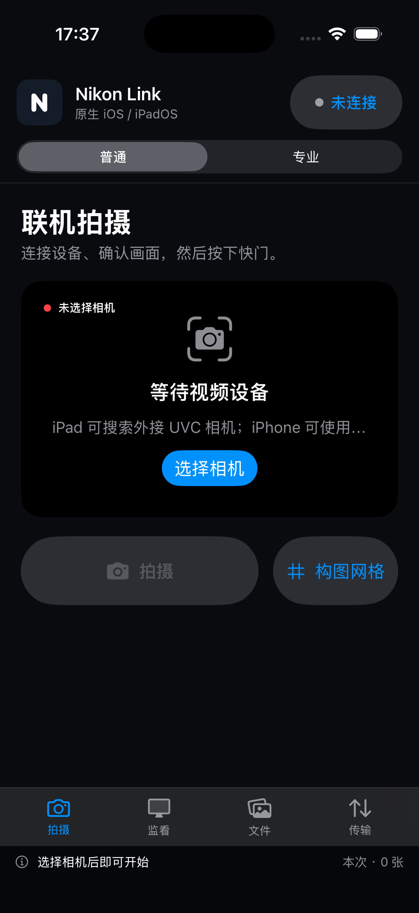

# Nikon Link

[简体中文](#简体中文) · [English](#english) · [日本語](#日本語)

<a id="简体中文"></a>

面向 Nikon Z 系列相机的三端原生连接、监看、拍摄与无线传图工具。

> 当前版本：**0.7.2 正式版**
>
> 支持平台：**macOS · Android · iOS / iPadOS**
>
> 支持机型：**Nikon Z9 · Z8 · Z f · Z6III · Z50II · Z5II · ZR**


Nikon Link 把联机拍摄、实时取景、常用曝光控制、监看辅助、FTP 无线收件箱和本地
照片管理放进一个统一工作流。安装包全部采用平台原生技术栈，不包含 WebView、
HTML 或 JavaScript 运行时；仓库中的 Web/PWA 只保留为历史演示，不参与安装包
构建。

界面将创作功能明确分成“照片”和“视频”两个工作区：照片区集中快门、曝光、
对焦、白平衡与本地照片保存；视频区集中实时监看、条纹图案、LUT、超采样及输出
规格。文件管理和无线传输则单独归入“管理”分组。

## 功能概览

| 工作流 | 主要能力 |
| --- | --- |
| 照片拍摄 | USB/PTP 相机识别、照片取景、SDRAM 拍摄与 JPEG 下载 |
| 照片控制 | P、S、A、M 与 B门；快门、光圈、ISO、曝光补偿、对焦与白平衡 |
| 视频监看 | 视频取景、加亮显示条纹图案、自定义 3D `.cube` LUT、本地 2× 超采样 |
| 无线传图 | 内置 FTP/PASV 收件箱，接收 JPEG、NEF、HEIF/HEIC 与 TIFF |
| 文件管理 | 本地预览、导入、分享、定位、删除及写入系统“照片” |
| 使用模式 | “普通”模式保留常用操作，“专业”模式展开完整参数 |

应用会根据 P、S、A、M/B门拍摄模式锁定当前不可调的曝光参数，避免把无效设置
写入机身。LUT、加亮显示条纹图案和超采样只处理监看画面，不修改原片或相机设置。

## 平台能力

| 能力 | macOS | Android | iOS / iPadOS |
| --- | :---: | :---: | :---: |
| Nikon USB/PTP 连接 | ✓ | ✓ | — |
| Nikon 实时取景与快门控制 | ✓ | ✓ | — |
| 曝光、对焦与白平衡控制 | ✓ | ✓ | — |
| 自定义 `.cube` LUT 与加亮显示 | ✓ | ✓ | — |
| FTP 无线收件箱 | ✓ | ✓ | ✓ |
| 本地照片库 | ✓ | ✓ | ✓ |
| 系统镜头拍摄 | — | — | ✓ |
| iPadOS 外接 UVC 视频设备 | — | — | ✓ |

- **macOS** 使用 SwiftUI/AppKit 与 `libgphoto2` 的 Nikon PTP 后端。
- **Android** 使用原生 Android View、USB Host API 和项目内 PTP 实现。
- **iOS/iPadOS** 使用 SwiftUI、AVFoundation 与 PhotoKit；支持本机镜头、
  iPadOS 外接 UVC 视频设备和前台 FTP 接收。

iOS 的公开接口不向普通应用提供通用 Nikon USB/PTP 厂商控制，因此 iPhone 和
iPad 不会把 UVC 视频输入伪装成 Nikon 快门、光圈、ISO 或原图下载能力。接入
这些能力需要 Nikon 提供 iOS 协议授权或官方 SDK。

## 原生界面

### macOS：无线收件箱


### iPhone：联机拍摄与移动端导航



以上截图来自当前原生应用在未连接相机时的实际运行界面。不同系统版本、屏幕尺寸
和连接状态下，控件布局与可用参数会按设备能力调整。

## 支持机型

所有支持机型使用 Nikon Vendor ID `0x04b0`。

| 机型 | USB Product ID | macOS | Android | iOS / iPadOS |
| --- | --- | --- | --- | --- |
| Nikon Z9 | `0x0450` | 原生 USB/PTP | 原生 USB/PTP | FTP；无 PTP |
| Nikon Z8 | `0x0451` | 原生 USB/PTP | 原生 USB/PTP | FTP；无 PTP |
| Nikon Z f | `0x0453` | 原生 USB/PTP | 原生 USB/PTP | FTP；无 PTP |
| Nikon Z6III | `0x0454` | 原生 USB/PTP | 原生 USB/PTP | FTP；无 PTP |
| Nikon Z50II | `0x0455` | 原生 USB/PTP | 原生 USB/PTP | FTP；无 PTP |
| Nikon Z5II | `0x0456` | PTP 兼容模式 | 原生 USB/PTP | FTP；无 PTP |
| Nikon ZR | `0x0457` | PTP 兼容模式 | 原生 USB/PTP | FTP；无 PTP |

应用优先匹配上表 Product ID，并以 USB 产品名称作为 ZR 等新机型的兼容回退。
检测到其他 Nikon USB 型号时会显示实际 Product ID，不会误报为受支持相机。
Z5II 与 ZR 在部分 `libgphoto2` 正式版中可能显示为通用 PTP 相机，macOS 版会
通过 USB 描述符二次确认。

## 安装

正式安装包应从
[GitHub Releases](https://github.com/Tauber01/NikonLink/releases) 下载，并
使用同名 `.sha256` 文件核对完整性。

### macOS

1. 打开 `NikonLink-0.7.2-macOS-arm64.dmg`。
2. 将 **Nikon Link** 拖到镜像内的 **Applications** 快捷入口。
3. 首次打开若被系统拦截，请前往“系统设置 → 隐私与安全性”确认。

当前社区 DMG 使用 ad-hoc 签名，尚未使用 Apple Developer ID 公证。

### Android

安装 `NikonLink-0.7.2-android.apk`。当前 APK 使用 Android 调试证书签名，
用于侧载和硬件验证，不用于 Play 商店发布。

### iOS / iPadOS

`NikonLink-0.7.2-ios-signed.ipa` 必须使用有效的 Apple Developer 证书和描述
文件生成，才能安装到授权设备。文件名包含 `ios-unsigned` 的 IPA 只用于验证
应用内容和 CI 构建，不能安装到真机。

详细签名步骤见 [iOS 签名与发布](docs/IOS_SIGNING.md)。

## USB 联机拍摄

1. 将相机更新到较新的稳定固件。
2. 关闭 NX Tether、Camera Control Pro 和其他可能占用相机的软件。
3. 使用支持数据传输的 USB-C 线直连 Mac 或 Android USB Host 设备，避免扩展坞。
4. 打开 Nikon Link，点击“连接相机”，并允许系统授予 USB 访问权限。
5. 等待实时取景出现，再调整参数或拍摄。

Nikon PTP 实时取景由相机返回原生 JPEG 帧。界面中的显示尺寸、LUT、加亮显示和
本地 2× 超采样只影响预览渲染，不等同于更改机身视频文件类型、分辨率或编码。

## Wi-Fi 无线传图

1. 让 Mac、Android、iPhone 或 iPad 与相机处于同一可信 Wi-Fi 网络；也可以
   使用相机直连热点。
2. 打开 Nikon Link 的“传输”页，点击“开启无线接收”，记下页面显示的服务器
   地址。
3. 在相机“网络菜单 → 连接到 FTP 服务器”中创建配置：

   | 项目 | 值 |
   | --- | --- |
   | 服务器类型 | `FTP` |
   | 服务器地址 | Nikon Link 显示的局域网 IPv4 地址 |
   | 端口 | `2121` |
   | 用户名 | `nikonlink` |
   | 密码 | `nikonlink` |
   | PASV 模式 | 开启 |

4. 在相机中选择照片上传，或开启自动上传。收到的文件会自动进入 Nikon Link
   本地照片库。

如果机身中没有“连接到 FTP 服务器”，请先确认机型能力并更新相机固件。FTP
收件箱未提供互联网级加密或账户隔离，只应在可信局域网中临时开启；传输完成后
请停止接收。iOS/iPadOS 进入后台时会自动停止收件箱。

## 本地构建

### 环境要求

- macOS 14+、Apple Silicon
- Homebrew 与 `libgphoto2`
- OpenJDK 17、Android SDK 35、Gradle
- 完整 Xcode、iPhoneOS SDK 与已安装的 iOS 平台组件

### 一次构建三个平台

```sh
./scripts/build-all.sh
```

默认生成：

```text
dist/NikonLink-0.7.2-macOS-arm64.dmg
dist/NikonLink-0.7.2-android.apk
dist/NikonLink-0.7.2-ios-unsigned.ipa
```

每个安装包都附带同名 `.sha256` 校验文件。生成可安装的签名 IPA：

```sh
IOS_DEVELOPMENT_TEAM=你的TeamID ./scripts/build-ios.sh --signed
```

构建脚本和 CI 不会把历史 Web/PWA 资源复制进 DMG、APK 或 IPA。

## 验证状态

0.7.2 正式版本已覆盖编译、容器结构、签名状态、原生 UI 启动和安装包 Web 资源
扫描。由于构建机器当前未连接全部 EXPEED 7 机型，USB/PTP、不同固件和镜头组合
仍以实机验收为发布门槛。

请按 [相机实机验收清单](docs/CAMERA_TEST_CHECKLIST.md) 逐项记录机型、固件、镜头、
数据线和主机系统版本。机身拒绝的参数会在界面中显示错误，不会静默伪装成功。

## 项目结构

```text
native/macos/      SwiftUI / AppKit 应用与 libgphoto2 集成
native/android/    原生 Android 应用与 USB Host PTP 实现
native/ios/        SwiftUI / AVFoundation / PhotoKit 应用
scripts/           DMG、APK、IPA 三端构建脚本
docs/              签名、术语、验收清单与 README 配图
```

更多资料：

- [Nikon 中文术语与 PTP 映射](docs/NIKON_TERMINOLOGY.md)
- [相机实机验收清单](docs/CAMERA_TEST_CHECKLIST.md)
- [iOS 签名与发布](docs/IOS_SIGNING.md)
- [安全说明](SECURITY.md)
- [版本记录](CHANGELOG.md)

## 许可与商标

应用源码使用 [MIT License](LICENSE)。macOS 安装包中的 gphoto2/libgphoto2 许可
见 [THIRD_PARTY_NOTICES.md](THIRD_PARTY_NOTICES.md)。仓库不包含 Nikon 专有 SDK。

Nikon、Z9、Z8、Z f、Z6III、Z50II、Z5II 与 ZR 为 Nikon Corporation 的商标。
本项目与 Nikon Corporation 无隶属、合作或背书关系。

---

<a id="english"></a>

## English

Nikon Link is a native macOS, Android, and iOS/iPadOS utility for connecting,
monitoring, controlling, and transferring files from Nikon Z-series cameras.

> Current version: **0.7.2 Stable Release**
>
> Platforms: **macOS · Android · iOS / iPadOS**
>
> EXPEED 7 cameras: **Nikon Z9 · Z8 · Z f · Z6III · Z50II · Z5II · ZR**

The interface separates creation into two clear workspaces. **Photo** contains
the shutter, exposure, focus, white balance, Picture Control, and local photo
workflow. **Video** contains live monitoring, zebra overlays, local 3D LUTs,
supersampling, and output controls. Files and wireless transfer live in a
separate management group.

### Features

| Workflow | Capabilities |
| --- | --- |
| Photo | USB/PTP detection, photo live view, SDRAM capture, and JPEG download |
| Photo controls | P/S/A/M and Bulb; shutter, aperture, ISO, exposure compensation, focus, and white balance |
| Video monitoring | Live view, zebra overlay, custom `.cube` LUT, and local 2× supersampling |
| Wireless transfer | Built-in FTP/PASV inbox for JPEG, NEF, HEIF/HEIC, and TIFF |
| File management | Local preview, import, share, reveal, delete, and save to Photos |
| Experience modes | Simple mode for common actions; Pro mode for full controls |

LUTs, zebra overlays, and supersampling affect only the monitoring image. They
do not modify the original file or the camera's recording settings.

### Platform capabilities

| Capability | macOS | Android | iOS / iPadOS |
| --- | :---: | :---: | :---: |
| Nikon USB/PTP connection | ✓ | ✓ | — |
| Nikon live view and shutter control | ✓ | ✓ | — |
| Exposure, focus, and white-balance control | ✓ | ✓ | — |
| Custom `.cube` LUT and zebra overlay | ✓ | ✓ | — |
| FTP wireless inbox | ✓ | ✓ | ✓ |
| Local photo library | ✓ | ✓ | ✓ |
| System-camera capture | — | — | ✓ |
| External UVC video on iPadOS | — | — | ✓ |

- **macOS** uses SwiftUI/AppKit and the Nikon PTP backend from `libgphoto2`.
- **Android** uses native Android Views, USB Host, and the in-project PTP
  implementation.
- **iOS/iPadOS** uses SwiftUI, AVFoundation, and PhotoKit for system cameras,
  external UVC input on iPadOS, and foreground FTP receiving.

Public iOS APIs do not expose general Nikon vendor-specific USB/PTP control to
ordinary applications. Nikon shutter, aperture, ISO, and original-file
download therefore require Nikon protocol authorization or an official SDK;
Nikon Link does not present a UVC stream as native Nikon control.

### Supported EXPEED 7 cameras

All listed cameras use Nikon USB Vendor ID `0x04b0`.

| Camera | USB Product ID | macOS | Android | iOS / iPadOS |
| --- | --- | --- | --- | --- |
| Nikon Z9 | `0x0450` | Native USB/PTP | Native USB/PTP | FTP; no PTP |
| Nikon Z8 | `0x0451` | Native USB/PTP | Native USB/PTP | FTP; no PTP |
| Nikon Z f | `0x0453` | Native USB/PTP | Native USB/PTP | FTP; no PTP |
| Nikon Z6III | `0x0454` | Native USB/PTP | Native USB/PTP | FTP; no PTP |
| Nikon Z50II | `0x0455` | Native USB/PTP | Native USB/PTP | FTP; no PTP |
| Nikon Z5II | `0x0456` | PTP compatibility mode | Native USB/PTP | FTP; no PTP |
| Nikon ZR | `0x0457` | PTP compatibility mode | Native USB/PTP | FTP; no PTP |

Nikon Link matches the Product ID first and can fall back to the USB product
name for newer profiles such as the ZR. An unsupported Nikon device is reported
with its actual Product ID instead of being presented as a supported camera.

### Install and connect

Download release artifacts and matching `.sha256` files from
[GitHub Releases](https://github.com/Tauber01/NikonLink/releases).

1. Update the camera to a recent stable firmware.
2. Quit NX Tether, Camera Control Pro, Photos, Image Capture, and any software
   that may claim the PTP interface.
3. Connect the camera directly with a data-capable USB-C cable.
4. Open Nikon Link, choose **Connect camera**, and grant USB access.
5. Start live view, adjust supported controls, and capture.

Nikon PTP live view supplies JPEG frames. Display resolution, LUT, zebra, and
local 2× supersampling change only preview rendering, not the camera's video
file type, resolution, or codec.

### Local build

Requirements include macOS 14+ on Apple Silicon, Homebrew with `libgphoto2`,
OpenJDK 17, Android SDK 35, Gradle, and a complete Xcode installation.

```sh
./scripts/build-all.sh
```

The build produces macOS DMG, Android APK, and unsigned iOS IPA artifacts in
`dist/`, each with a matching SHA-256 checksum. See
[iOS signing](docs/IOS_SIGNING.md) for a device-installable IPA.

Hardware verification across every camera, firmware, lens, cable, and host
combination remains a release gate. Record results with the
[camera test checklist](docs/CAMERA_TEST_CHECKLIST.md).

The source is licensed under the [MIT License](LICENSE). Nikon and the camera
model names are trademarks of Nikon Corporation. This project is not affiliated
with, endorsed by, or sponsored by Nikon Corporation.

[Back to language selection](#nikon-link)

---

<a id="日本語"></a>

## 日本語

Nikon Link は、Nikon Z シリーズの接続、モニタリング、撮影制御、ファイル転送を
行う macOS・Android・iOS/iPadOS 向けネイティブアプリです。

> 現在のバージョン：**0.7.2 正式リリース**
>
> 対応プラットフォーム：**macOS · Android · iOS / iPadOS**
>
> EXPEED 7 対応機種：**Nikon Z9 · Z8 · Z f · Z6III · Z50II · Z5II · ZR**

画面は **写真** と **動画** の二つの制作ワークスペースに分かれています。
写真にはシャッター、露出、フォーカス、ホワイトバランス、ピクチャーコントロール、
ローカル保存を集約し、動画にはライブビュー、ゼブラ表示、3D LUT、スーパー
サンプリング、出力設定を集約しています。ファイルとワイヤレス転送は管理グループ
から操作します。

### 主な機能

| ワークフロー | 機能 |
| --- | --- |
| 写真 | USB/PTP 検出、写真ライブビュー、SDRAM 撮影、JPEG ダウンロード |
| 写真制御 | P/S/A/M・バルブ、シャッター、絞り、ISO、露出補正、AF、ホワイトバランス |
| 動画モニター | ライブビュー、ゼブラ表示、カスタム `.cube` LUT、ローカル 2× スーパーサンプリング |
| ワイヤレス転送 | JPEG、NEF、HEIF/HEIC、TIFF を受信する FTP/PASV 受信ボックス |
| ファイル管理 | ローカル表示、読み込み、共有、場所表示、削除、「写真」への保存 |
| 操作モード | よく使う操作だけの「普通」と、全設定を表示する「プロ」 |

LUT、ゼブラ表示、スーパーサンプリングはモニター画像だけに適用されます。原本や
カメラ本体の動画記録設定は変更しません。

### プラットフォーム別機能

| 機能 | macOS | Android | iOS / iPadOS |
| --- | :---: | :---: | :---: |
| Nikon USB/PTP 接続 | ✓ | ✓ | — |
| Nikon ライブビュー・シャッター制御 | ✓ | ✓ | — |
| 露出・フォーカス・ホワイトバランス | ✓ | ✓ | — |
| カスタム `.cube` LUT・ゼブラ表示 | ✓ | ✓ | — |
| FTP ワイヤレス受信 | ✓ | ✓ | ✓ |
| ローカル写真ライブラリ | ✓ | ✓ | ✓ |
| システムカメラ撮影 | — | — | ✓ |
| iPadOS 外付け UVC ビデオ | — | — | ✓ |

- **macOS**：SwiftUI/AppKit と `libgphoto2` の Nikon PTP バックエンド。
- **Android**：ネイティブ Android View、USB Host、内蔵 PTP 実装。
- **iOS/iPadOS**：SwiftUI、AVFoundation、PhotoKit。本体カメラ、iPadOS の
  外付け UVC、フォアグラウンド FTP 受信に対応。

iOS の公開 API は、一般アプリに Nikon 固有の USB/PTP 制御を提供していません。
Nikon のシャッター、絞り、ISO、原本ダウンロードには、Nikon のプロトコル認可
または公式 SDK が必要です。Nikon Link は UVC 入力を Nikon ネイティブ制御と
して表示しません。

### EXPEED 7 対応機種

全機種の Nikon USB Vendor ID は `0x04b0` です。

| 機種 | USB Product ID | macOS | Android | iOS / iPadOS |
| --- | --- | --- | --- | --- |
| Nikon Z9 | `0x0450` | ネイティブ USB/PTP | ネイティブ USB/PTP | FTP、PTP 非対応 |
| Nikon Z8 | `0x0451` | ネイティブ USB/PTP | ネイティブ USB/PTP | FTP、PTP 非対応 |
| Nikon Z f | `0x0453` | ネイティブ USB/PTP | ネイティブ USB/PTP | FTP、PTP 非対応 |
| Nikon Z6III | `0x0454` | ネイティブ USB/PTP | ネイティブ USB/PTP | FTP、PTP 非対応 |
| Nikon Z50II | `0x0455` | ネイティブ USB/PTP | ネイティブ USB/PTP | FTP、PTP 非対応 |
| Nikon Z5II | `0x0456` | PTP 互換モード | ネイティブ USB/PTP | FTP、PTP 非対応 |
| Nikon ZR | `0x0457` | PTP 互換モード | ネイティブ USB/PTP | FTP、PTP 非対応 |

Product ID を優先して照合し、ZR などの新しい機種では USB 製品名もフォール
バックとして利用します。未対応の Nikon USB 機器は、対応機種として誤表示せず、
実際の Product ID を表示します。

### インストールと接続

[GitHub Releases](https://github.com/Tauber01/NikonLink/releases) から
インストールファイルと同名の `.sha256` をダウンロードしてください。

1. カメラを新しい安定版ファームウェアへ更新します。
2. NX Tether、Camera Control Pro、「写真」、「イメージキャプチャ」など、
   PTP インターフェースを使用するアプリを終了します。
3. データ通信対応 USB-C ケーブルでカメラを直接接続します。
4. Nikon Link で「カメラを接続」を選び、USB アクセスを許可します。
5. ライブビューを開始し、利用可能な設定を調整して撮影します。

Nikon PTP ライブビューは JPEG フレームを返します。表示サイズ、LUT、ゼブラ、
ローカル 2× スーパーサンプリングはプレビュー表示だけを変更し、カメラ本体の
動画ファイル形式、解像度、コーデックは変更しません。

### ローカルビルド

macOS 14+（Apple Silicon）、Homebrew と `libgphoto2`、OpenJDK 17、
Android SDK 35、Gradle、完全な Xcode 環境が必要です。

```sh
./scripts/build-all.sh
```

`dist/` に macOS DMG、Android APK、未署名 iOS IPA と各 SHA-256 チェックサムを
生成します。実機へインストールできる IPA については
[iOS 署名手順](docs/IOS_SIGNING.md)を参照してください。

すべての機種、ファームウェア、レンズ、ケーブル、ホスト環境の組み合わせは実機
検証がリリース条件です。[カメラ実機テストチェックリスト](docs/CAMERA_TEST_CHECKLIST.md)
に結果を記録してください。

ソースコードは [MIT License](LICENSE) で提供されます。Nikon および各機種名は
Nikon Corporation の商標です。本プロジェクトは Nikon Corporation との提携、
承認、スポンサー関係を持ちません。

[言語選択へ戻る](#nikon-link)
